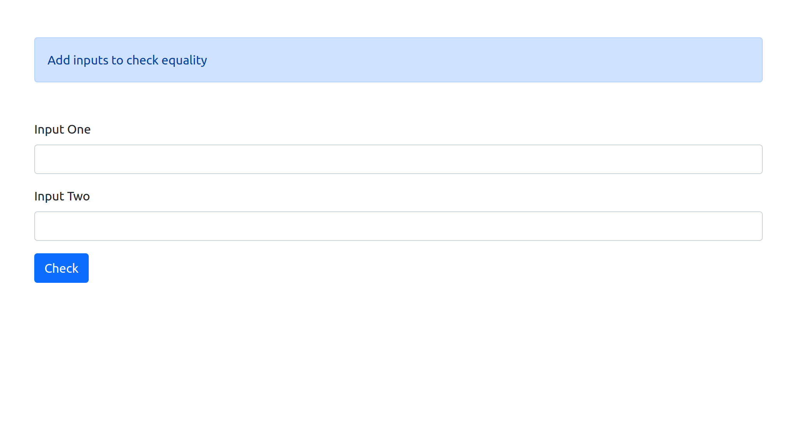

# Equality Checker
Checks if two inputs are equal. Built with vanilla javascript, HTML and bootstrap.

## Use Equality Checker

- [Equality Checker](https://ershadul.me/equality-checker/)

## Screenshot

## Built With

- HTML/CSS
- Javascript
- Bootstrap

## How to run this project on your local machine

### Prerequisites
1. An internet browser
1. npm
   
### Steps to follow
1. Clone the repository to your local machine using `git clone https://github.com/ershadul1/equality-checker.git`
1. On your local machine, navigate to the folder using `cd bug-tracker` in your terminal.
1. Run `npm install` for installing all the dependencies.
1. Run `npm start` to run the app on your local webserver.
1. Visit the link you got in the command line, with your browser.

## Contributions

  There are two ways of contributing to this project:

1.  If you see something wrong or not working, please check [the issue tracker section](https://github.com/ershadul1/equality-checker/issues), if that problem you met is not in already opened issues then open the issue by clicking on the `new issue` button.

2.  If you have a solution to that, and you are willing to work on it, follow the below steps to contribute:
    1.  Fork this repository
    1.  Clone it on your local computer by running `git clone https://github.com/ershadul1/equality-checker.git` __Replace *ershadul1* with the username you use on github__
    1.  Open the cloned repository which appears as a folder on your local computer with your favorite code editor
    1.  Create a separate branch of the *master branch*,
    1.  Write your codes that fix the issue you found
    1.  Commit and push the branch you created
    1.  Raise a pull request, comparing your new created branch with our original master branch [here](https://github.com/ershadul1/equality-checker)

## Author 

👤 **Ershadul Rayhan**

- Github: [@ershadul1](https://github.com/ershadul1)
- Twitter: [@ErshadulRayhan](https://twitter.com/ErshadulRayhan)
- Linkedin: [ErshadulRayhan](https://www.linkedin.com/in/ershadulrayhan/)
- Email:  ershadul.rayhan@gmail.com

## Show your support

Give a ⭐️ if you like this project!